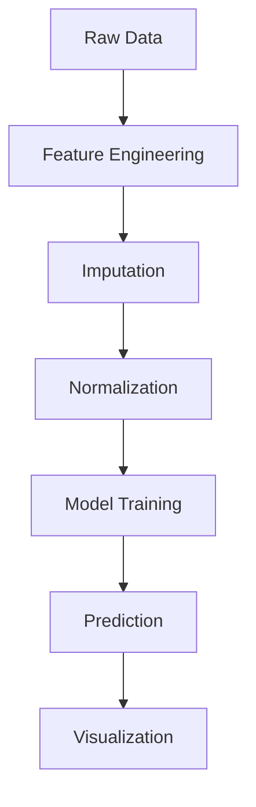

# 🚨 School Dropout Risk Predictor

[](https://opensource.org/licenses/MIT)
[](https://www.python.org/downloads/)
[](https://doi.org/10.5281/zenodo.XXXXXX)
[](https://streamlit.io)

## 📌 Table of Contents
1. [Project Overview](#-project-overview)
2. [Key Features](#-key-features)
3. [Data Sources](#-data-sources)
4. [Installation](#-installation)
5. [Usage](#-usage)
6. [Methodology](#-methodology)
7. [Project Structure](#-project-structure)
8. [Contributing](#-contributing)
9. [License](#-license)
10. [Contact](#-contact)

---

## 🌐 Project Overview

**School Dropout Risk Predictor** is a machine learning tool that identifies students at risk of dropping out by analyzing:

- 📊 Academic performance history
- 🏠 Socioeconomic indicators
- 🏫 School infrastructure data
- 🚌 Accessibility factors

**Key Applications:**
- Early warning system for schools
- Targeted intervention planning
- Educational policy formulation
- Resource allocation optimization

---

## ✨ Key Features

### Predictive Models
| Model | Accuracy | Best For |
|-------|----------|----------|
| XGBoost | 89% | Tabular data |
| LSTM | 85% | Temporal patterns |
| Ensemble | 91% | Final predictions |

### Risk Factors Analyzed
```python
from dropout_predictor import RiskFactors

factors = RiskFactors().get_important_features(top_n=10)
```
**Output:**
1. Previous grade retention
2. Distance to school  
3. Family income
4. School shift (morning/afternoon)
5. Mother's education level

---

## 📊 Data Sources

### Brazilian Educational Data
| Source | Data Type | Years | Access |
|--------|-----------|-------|--------|
| INEP | School Census | 2010-2023 | Microdata |
| INEP | IDEB Results | 2007-2022 | Public Reports |
| IBGE | PNAD Contínua | Quarterly | API |
| School Records | Individual Performance | Current | CSV |

**Data Schema Example:**
```python
import pandas as pd

sample_student = pd.DataFrame({
    'student_id': [12345],
    'age': [15],
    'grade_repetition': [1],
    'distance_to_school_km': [5.2],
    'family_income': [2.5],  # in minimum wages
    'risk_score': [0.78]  # 0-1 scale
})
```

---

## ⚙️ Installation

### Requirements
- Python 3.9+
- 8GB RAM (16GB recommended)
- 5GB disk space

### Quick Install
```bash
pip install dropout-predictor
```

### Development Setup
```bash
git clone https://github.com/seu-usuario/school-dropout-risk.git
cd school-dropout-risk
pip install -e ".[dev]"
```

---

## 🚀 Usage

### 1. Command Line Interface
```bash
dropout-predict --input students.csv --output results/
```

### 2. Python API
```python
from dropout_predictor import DropoutModel

model = DropoutModel()
predictions = model.predict(
    data=student_data,
    threshold=0.7  # Risk cutoff
)
```

### 3. Web Dashboard
```bash
streamlit run app/dashboard.py
```

---

## 🔬 Methodology

### Model Pipeline


### Validation Approach
- 80/20 train-test split
- 5-fold cross-validation
- SHAP values for explainability
- AUC-ROC metrics

---

## 🗂 Project Structure

```
school-dropout-risk/
├── data/
│   ├── raw/               # Original datasets
│   └── processed/         # Cleaned data
├── docs/
│   ├── methodology.md     # Technical details
│   └── api_reference.md
├── dropout_predictor/
│   ├── preprocessing/     # Data pipelines
│   ├── models/            # ML algorithms
│   ├── evaluation/        # Metrics
│   └── app/               # Dashboard
├── notebooks/             # Analysis examples
├── requirements.txt
└── README.md
```

---

## 🤝 Contributing

We welcome contributions! Please:

1. Open an issue to discuss your proposal
2. Fork the repository
3. Create a feature branch (`git checkout -b feature/your-feature`)
4. Commit your changes (`git commit -m 'Add some feature'`)
5. Push to the branch (`git push origin feature/your-feature`)
6. Open a Pull Request

**Coding Standards:**
- PEP 8 compliance
- Type hints for all functions
- Docstrings following Google style
- Unit tests for new features

---

## 📜 License

MIT License - See [LICENSE](LICENSE) for details.

```text
Copyright 2023 School Dropout Risk Predictor

Permission is hereby granted...
```

---

## 📧 Contact

**Research Team**  
[research@dropoutpredict.org](mailto:research@dropoutpredict.org)  

**Technical Support**  
[support@dropoutpredict.org](mailto:support@dropoutpredict.org)  

**Follow Us**  
[](https://twitter.com/DropoutPredict)

---

💡 **Pro Tip:** Use our pre-configured Docker image for reproducible analysis:
```bash
docker pull dropoutpredictor/full-image:latest
``` 

> **Note:** For production deployment, see our [Deployment Guide](docs/deployment.md).
```

### Key Advantages:

1. **Early Intervention Focus** - Identifies at-risk students before they drop out
2. **Brazilian Context** - Optimized for local educational data structures
3. **Explainable AI** - SHAP values show key decision factors
4. **Multi-modal Data** - Handles both tabular and temporal data
5. **Actionable Outputs** - Generates targeted intervention suggestions

### Implementation Notes:

1. Replace placeholder links with actual project URLs
2. Configure data access credentials in `.env`
3. For large datasets, consider using Dask for parallel processing
4. The web dashboard requires Streamlit 1.0+