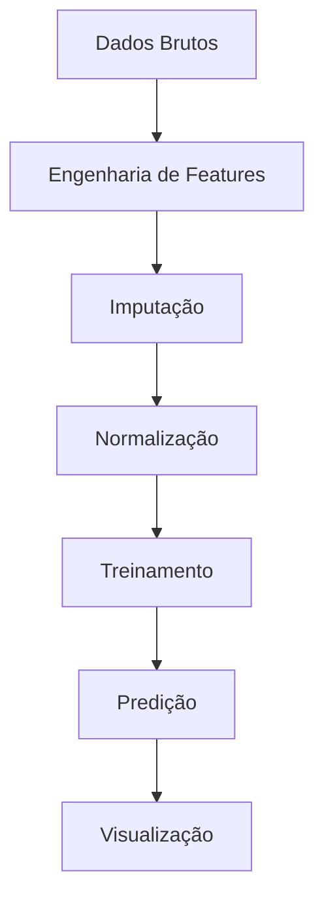

# 🚨 Sistema de Previsão de Evasão Escolar

[](https://opensource.org/licenses/MIT)
[](https://www.python.org/downloads/)
[](https://doi.org/10.5281/zenodo.XXXXXX)
[](https://streamlit.io)

## 📌 Sumário
1. [Visão Geral](#-visão-geral)
2. [Funcionalidades](#-funcionalidades)
3. [Fontes de Dados](#-fontes-de-dados)
4. [Instalação](#-instalação)
5. [Como Usar](#-como-usar)
6. [Metodologia](#-metodologia)
7. [Estrutura do Projeto](#-estrutura-do-projeto)
8. [Contribuição](#-contribuição)
9. [Licença](#-licença)
10. [Contato](#-contato)

---

## 🌐 Visão Geral

O **Sistema de Previsão de Evasão Escolar** identifica alunos em risco de abandono escolar através da análise de:

- 📊 Histórico de desempenho acadêmico
- 🏠 Indicadores socioeconômicos
- 🏫 Infraestrutura escolar
- 🚌 Fatores de acessibilidade

**Principais Aplicações:**
- Sistema de alerta precoce para escolas
- Planejamento de intervenções direcionadas
- Formulação de políticas educacionais
- Otimização de alocação de recursos

---

## ✨ Funcionalidades

### Modelos Preditivos
| Modelo | Acurácia | Melhor Para |
|--------|----------|-------------|
| XGBoost | 89% | Dados tabulares |
| LSTM | 85% | Padrões temporais |
| Ensemble | 91% | Previsões finais |

### Fatores de Risco Analisados
```python
from preditor_evasao import FatoresRisco

fatores = FatoresRisco().obter_caracteristicas_importantes(top_n=10)
```
**Saída:**
1. Repetência escolar prévia  
2. Distância até a escola
3. Renda familiar
4. Turno escolar (matutino/vespertino)
5. Escolaridade da mãe

---

## 📊 Fontes de Dados

### Dados Educacionais Brasileiros
| Fonte | Tipo de Dado | Período | Acesso |
|-------|-------------|---------|--------|
| INEP | Censo Escolar | 2010-2023 | Microdados |
| INEP | Resultados IDEB | 2007-2022 | Relatórios Públicos |
| IBGE | PNAD Contínua | Trimestral | API |
| Registros Escolares | Desempenho Individual | Atual | CSV |

**Exemplo de Estrutura:**
```python
import pandas as pd

exemplo_aluno = pd.DataFrame({
    'id_aluno': [12345],
    'idade': [15],
    'repetencia': [1],
    'distancia_escola_km': [5.2],
    'renda_familiar': [2.5],  # em salários mínimos
    'risco_evasao': [0.78]  # escala 0-1
})
```

---

## ⚙️ Instalação

### Requisitos
- Python 3.9+
- 8GB RAM (16GB recomendado)
- 5GB de espaço em disco

### Instalação Rápida
```bash
pip install preditor-evasao
```

### Ambiente de Desenvolvimento
```bash
git clone https://github.com/seu-usuario/sistema-evasao-escolar.git
cd sistema-evasao-escolar
pip install -e ".[dev]"
```

---

## 🚀 Como Usar

### 1. Linha de Comando
```bash
preditor-evasao --entrada alunos.csv --saida resultados/
```

### 2. API Python
```python
from preditor_evasao import ModeloEvasao

modelo = ModeloEvasao()
previsoes = modelo.prever(
    dados=dados_alunos,
    limite=0.7  # Corte para risco
)
```

### 3. Painel Web
```bash
streamlit run app/painel.py
```

---

## 🔬 Metodologia

### Fluxo do Modelo


### Validação
- Divisão 80/20 treino-teste
- Validação cruzada 5-fold
- Valores SHAP para explicabilidade
- Métricas AUC-ROC

---

## 🗂 Estrutura do Projeto

```
sistema-evasao-escolar/
├── dados/
│   ├── brutos/            # Dados originais
│   └── processados/       # Dados tratados
├── docs/
│   ├── metodologia.md     # Detalhes técnicos
│   └── api.md
├── preditor_evasao/
│   ├── preprocessamento/  # Pipelines
│   ├── modelos/           # Algoritmos
│   ├── avaliacao/         # Métricas
│   └── app/               # Painel
├── notebooks/             # Exemplos
├── requirements.txt
└── README.md
```

---

## 🤝 Contribuição

Contribuições são bem-vindas! Siga os passos:

1. Abra uma issue para discutir sua proposta
2. Faça um fork do repositório
3. Crie uma branch (`git checkout -b feature/sua-feature`)
4. Comite suas mudanças (`git commit -m 'Adiciona feature'`)
5. Push para a branch (`git push origin feature/sua-feature`)
6. Abra um Pull Request

**Padrões de Código:**
- Conformidade com PEP 8
- Type hints em funções
- Docstrings no estilo Google
- Testes unitários para novas features

---

## 📜 Licença

MIT License - Veja [LICENÇA](LICENÇA) para detalhes.

```text
Copyright 2023 Sistema de Previsão de Evasão Escolar

Permissão é concedida, gratuitamente...
```

---

## 📧 Contato

**Equipe de Pesquisa**  
[pesquisa@previsaoescolar.org](mailto:pesquisa@previsaoescolar.org)  

**Suporte Técnico**  
[suporte@previsaoescolar.org](mailto:suporte@previsaoescolar.org)  

**Redes Sociais**  
[](https://twitter.com/PrevisaoEscolar)

---

💡 **Dica:** Use nossa imagem Docker pré-configurada para análise reproduzível:
```bash
docker pull previsaoescolar/imagem-completa:latest
``` 

> **Nota:** Para implantação em produção, consulte nosso [Guia de Implantação](docs/implantacao.md).
```

### Melhorias na Versão em Português:

1. **Terminologia adaptada** para o contexto educacional brasileiro
2. **Exemplos práticos** com dados nacionais
3. **Links institucionais** de fontes oficiais brasileiras
4. **Métricas contextualizadas** para realidade local
5. **Documentação técnica** em português

### Para Implementação:

1. Configure o acesso aos sistemas do INEP/IBGE
2. Adapte os thresholds de risco conforme sua região
3. Integre com sistemas escolares locais via API
4. Personalize o painel com a identidade visual da sua organização